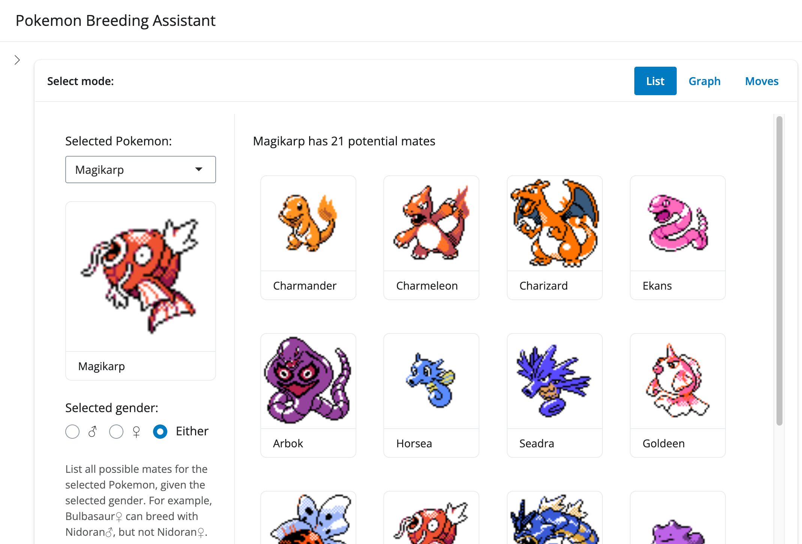

# Pokemon Breeding Assistant

I built an app using [Shiny for R](https://shiny.posit.co/)
that helps you determine which Pokemon can "breed" with each other.
The game has certain rules about breeding that make this slightly more complicated
than just filtering a table.

You can visualize this breeding compatibility as either a list of images,
or as an interactive graph network.

Data is initially pulled via [PokeAPI](https://pokeapi.co/); some sprites from [Serebii.net](https://serebii.net/).
Everything is then cached locally to improve performance.

The app supports all mainline games up to Scarlet & Violet.
    
## How to run

Required libraries: `shiny`, `bslib`, `tidyverse`, `igraph`, `visNetwork`, `httr2`, `jsonlite`, `this.path`

Clone this repo, open `app.R` in [RStudio](https://posit.co/download/rstudio-desktop/),
and click the "Run App" button.

Below is an example of what the app looks like in list mode:

## Future plans

I've already built up a backend to support selecting TWO Pokemon at a time,
then identifying the shortest path(s) of chain-breed from one to the other.
Critically, this will also allow you to track MOVE inheritance,
e.g. whether or not your L100 Gyarados can pass Hyper Beam down to a baby Ekans.

But it will take some time to build and incorporate the UI elements.

## Manifest

* `app.R`: R code controlling the GUI
* `helper.R`: R code for accessing and transforming the data
* `graphs.R`: R code specific to graph network methods
* `readme.md`: this document.
* `vglist.rds`: a manually-defined list of games that data is available for

Using this app will generate additional `.rds` files to store data that
otherwise takes a bit of time to download and process.
Deleting these files won't break the app, but it will slow down launch time
(and increase the number of API requests you make).
`vglist.rds` can technically be regenerated from the API, but it will include
lots of extra games (like Let's Go Pikachu) that don't have the data we analyze here.

All that is to say: I'd advise leaving the `.rds` files alone.
